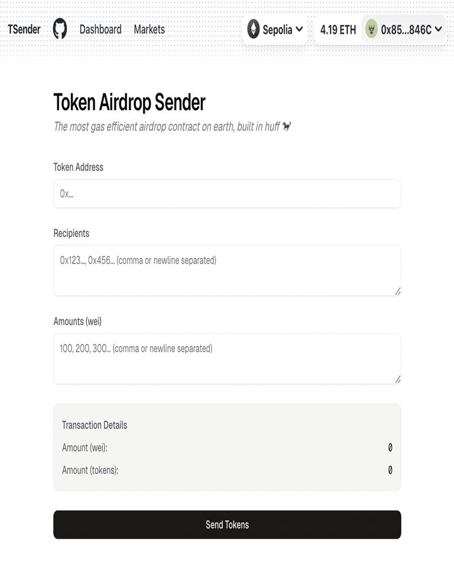
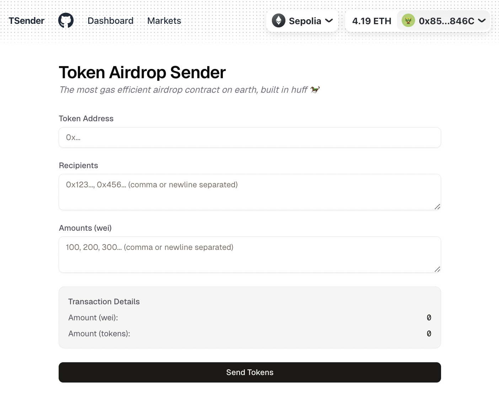
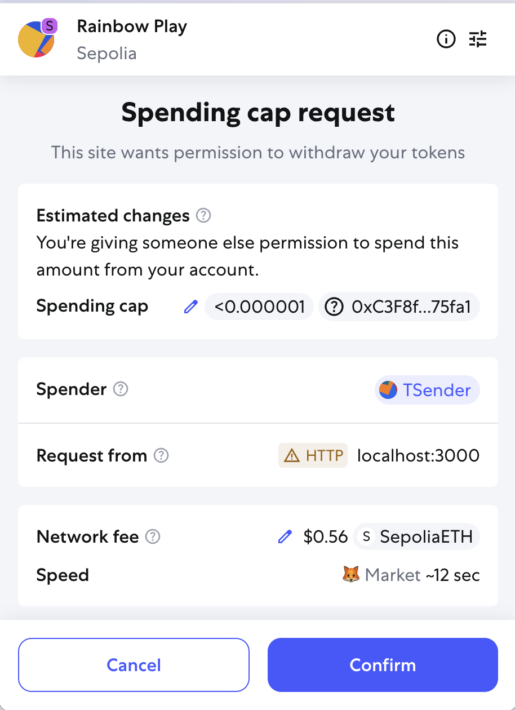
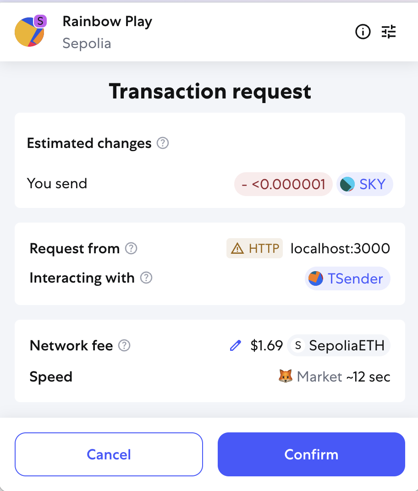

# 🚀 TSender UI — Gas-Optimized ERC20 Airdrop Dashboard

[](https://app.netlify.com/projects/token-airdrop-sender-202506/deploys)

A full-stack Web3 dashboard that replicates the functionality of [`t-sender.com`](https://t-sender.com), allowing admins to airdrop ERC20 tokens to multiple recipients via a highly gas-optimized smart contract (written in Huff). Built with modular Web3 hooks, secure wallet integration, and a responsive, user-focused interface.

[🌐 Live Demo](https://token-airdrop-sender-202506.netlify.app/) | [🧠 Learn More](#learn-more)

### 🎥 Demo (Approve & Airdrop Flow)



> 🖼️ This shows the full flow:
>
> 1. User fills the form with token + recipient data
> 2. Wallet prompts for ERC20 approval
> 3. User confirms the airdrop transaction

---

This is a [Next.js](https://nextjs.org) project bootstrapped with [`create-next-app`](https://nextjs.org/docs/app/api-reference/cli/create-next-app).

## Getting Started

First, run the development server:

```bash
npm run dev
# or
yarn dev
# or
pnpm dev
# or
bun dev
```

Open [http://localhost:3000](http://localhost:3000) with your browser to see the result.

You can start editing the page by modifying `app/page.tsx`. The page auto-updates as you edit the file.

This project uses [`next/font`](https://nextjs.org/docs/app/building-your-application/optimizing/fonts) to automatically optimize and load [Geist](https://vercel.com/font), a new font family for Vercel.

## Deploy on Vercel

The easiest way to deploy your Next.js app is to use the [Vercel Platform](https://vercel.com/new?utm_medium=default-template&filter=next.js&utm_source=create-next-app&utm_campaign=create-next-app-readme) from the creators of Next.js.

Check out our [Next.js deployment documentation](https://nextjs.org/docs/app/building-your-application/deploying) for more details.

---

<a name="learn-more"></a>

## 🎯 Project Objective

Build a front-end dashboard to interact with the TSender smart contract, enabling admins to airdrop ERC20 tokens to multiple recipients in a single, gas-optimized transaction.

This mimics the functionality of platforms like t-sender.com and demonstrates smart contract interaction, approval flows, and wallet integration with a user-friendly UI.

## 🖼 Screenshots

### Airdrop Form (Pre-submit)



### MetaMask Approval (Approve Token Spend)



### MetaMask TX Confirmation (Airdrop)



---

## 🔧 Build Steps

<details>
<summary>1. 📦 Project Setup</summary>

- Create a **React / Next.js** project (static).
- Install and configure the following libraries:

  ```bash
  pnpm add wagmi viem @rainbow-me/rainbowkit
  pnpm add @hookform/resolvers zod react-hook-form
  ```

- Setup `shadcn/ui` for the form, inputs, and components.

</details>

<details>
<summary>2. 🔌 Wallet Integration</summary>

- Configure **wagmi** and **RainbowKit**.
- Wrap your app in the required providers (`WagmiConfig`, `RainbowKitProvider`, etc.).
- Add a **Connect Wallet** button using RainbowKit.
- Create the **Airdrop Form** using `shadcn/ui` with `Form`, `Input`, and `Textarea`.

</details>

<details>
<summary>3. 🧠 Allowance + Airdrop Flow</summary>

### 🛠 Contract Function

The core smart contract function looks like:

```solidity
function airdropERC20(
    address tokenAddress,      // ERC20 token to be airdropped
    address[] calldata recipients, // Wallets to receive tokens
    uint256[] calldata amounts,    // Corresponding token amounts
    uint256 totalAmount            // Sum of all amounts
) external;
```

### 🧩 Frontend Logic

✅ **Step 1: Get Required Data with Wagmi Hooks**

- Use `useAccount`, `useChainId`, and `useConfig` to access wallet and network info.
- Use `useWatch` to track form values in real time.

✅ **Step 2: Fetch Allowance**

- Create a `getApprovedAmount` helper function.
- This encapsulates the logic for calling `allowance()` on the ERC20 token contract using `readContract` from `@wagmi/core`.
- Use it to check if the user has approved the TSender contract to spend tokens.

✅ **Step 3: Conditional Logic**  
Compare the `approvedAmount` with the `total` amount needed:

- If `approvedAmount < total`, call `approve(...)` using `writeContractAsync`.
- If approved, or already sufficient, proceed to the airdrop step.

✅ **Step 4: Airdrop Tokens**

- Call `airdropERC20(...)` with the parsed recipient and amount lists.
- Wait for transaction confirmation.
- Read and display recipient balances after airdrop using `balanceOf(...)`.

</details>

<details>
<summary>4. 🚀 Deployment</summary>

Deploy this static frontend to:

- **Fleek** (IPFS-based deployment)
- **Vercel** or **Netlify** (for non-IPFS)

</details>

---

## ⚙️ Supported Chains & Deployed TSender Contracts

This dApp supports multiple EVM chains where the TSender airdrop smart contract has already been deployed.

| Chain            | Chain ID | TSender Address                              | Explorer Link                                                                                              |
| ---------------- | -------- | -------------------------------------------- | ---------------------------------------------------------------------------------------------------------- |
| Ethereum Mainnet | 1        | `0x3aD9F29AB266E4828450B33df7a9B9D7355Cd821` | [Etherscan](https://etherscan.io/address/0x3aD9F29AB266E4828450B33df7a9B9D7355Cd821)                       |
| Optimism         | 10       | `0xAaf523DF9455cC7B6ca5637D01624BC00a5e9fAa` | [Optimistic Etherscan](https://optimistic.etherscan.io/address/0xAaf523DF9455cC7B6ca5637D01624BC00a5e9fAa) |
| Arbitrum One     | 42161    | `0xA2b5aEDF7EEF6469AB9cBD99DE24a6881702Eb19` | [Arbiscan](https://arbiscan.io/address/0xA2b5aEDF7EEF6469AB9cBD99DE24a6881702Eb19)                         |
| Base             | 8453     | `0x31801c3e09708549c1b2c9E1CFbF001399a1B9fa` | [BaseScan](https://basescan.org/address/0x31801c3e09708549c1b2c9E1CFbF001399a1B9fa)                        |
| zkSync Era       | 324      | `0x7e645Ea4386deb2E9e510D805461aA12db83fb5E` | [zkSync Explorer](https://explorer.zksync.io/address/0x7e645Ea4386deb2E9e510D805461aA12db83fb5E)           |
| Sepolia Testnet  | 11155111 | `0xa27c5C77DA713f410F9b15d4B0c52CAe597a973a` | [Sepolia Etherscan](https://sepolia.etherscan.io/address/0xa27c5C77DA713f410F9b15d4B0c52CAe597a973a)       |
| Anvil (Local)    | 31337    | `0x5FbDB2315678afecb367f032d93F642f64180aa3` | Local only                                                                                                 |

---

### ✅ TSender Compatibility

- ✅ This frontend supports **all chains listed above** via **RainbowKit + Wagmi**.
- ✅ You can use **any standard ERC20 token** on these chains, including custom ones you deploy yourself.
- ✅ All deployments use the **same TSender interface** — no frontend changes needed across networks.
- ✅ As long as your ERC20 token implements `approve()` and `transferFrom()`, the UI works out of the box.
- ✅ You can also deploy your own ERC20 token to these networks and use this dashboard to airdrop.

---

### ✅ Verified Deployment

[](https://sepolia.etherscan.io/token/0xC3F8ffA25823E768500F9361D872d2bc7d275fa1)

- **Token**: `OanskyToken`
- **Address**: [`0xC3F8ffA25823E768500F9361D872d2bc7d275fa1`](https://sepolia.etherscan.io/token/0xC3F8ffA25823E768500F9361D872d2bc7d275fa1)
- ✅ Supports full `approve()` → `airdropERC20()` flow
- ✅ Fully tested with TSender on Sepolia

---

## 🛠 Tech Stack

- **Framework**: Next.js (React + TypeScript)
- **Web3 Libraries**: Wagmi · Viem · Ethers.js · RainbowKit
- **Styling**: Tailwind CSS
- **State/Logic**: Custom React hooks · Utility functions
- **Testing**: Anvil (Foundry) for local testnet
- **Deployment**: Fleek (IPFS-based static hosting)
- **Data Viz (optional)**: Recharts (for token distribution)
- **Performance**: Lighthouse reports
- **Linting & Formatting**: ESLint · Prettier
- **Testing**:
  - Unit tests with Jest
  - Planned E2E tests with Playwright

---

## 🔑 Core Features

- 🔐 Connect Wallet (MetaMask, WalletConnect via RainbowKit)
- 🌐 Supports multiple chains: Mainnet, Optimism, Arbitrum, ZK Sync, Base, Sepolia, Anvil
- 📥 Inputs:
  - Token address
  - Recipient addresses
  - Amounts (textarea or CSV)
- 🔎 Dynamic token data fetching (name, decimals)
- 📊 Live transaction preview (total in wei & formatted)
- ✅ Step-by-step execution:
  - `approve` token spending for TSender(Airdrop)(Huff) smart contract
  - `airdrop` to multiple recipients
- 🚨 Handles mismatched address/amount inputs with clear errors
- 🧹 Clean, responsive, accessible UI built with Tailwind

---

## 🎯 Focus Areas

### 🧠 Web3 Integration

- Smart contract interaction via Wagmi & Viem
- Secure wallet connection and transaction signing
- Live contract reads (e.g., decimals, balances)
- Multi-chain support with network switching
- Optimized for minimal gas usage per batch
- Wallet connection flow with custom hooks

### 🎨 UI/UX Design

- Designed for clarity and speed in complex Web3 flows (Clear user flow from input to confirmation)
- Clean input validation, visual feedback, and loading states
- Modular components using Tailwind
- Transaction feedback via toasts and loaders
- Fully responsive layout, accessible design

### 🔐 Security & Gas Awareness

- UI supports safe usage of a gas-optimized Huff contract
- Shows token totals before signing to avoid mistakes
- Statically hosted frontend — no backend to compromise

### Frontend Code Quality

- Modular structure (hooks, components, utils)
- Linting, formatting, and reusable logic

---

<details open>
<summary>🚀 MVP Scope (Core Features Only)</summary>

| Feature Area             | Feature Description                        | Status         |
| ------------------------ | ------------------------------------------ | -------------- |
| 🧠 Smart Contract Logic  | Connect wallet with RainbowKit             | ✅ Done        |
|                          | Check ERC20 allowance via `readContract`   | ✅ Done        |
|                          | Approve tokens via `writeContract`         | ✅ Done        |
|                          | Trigger airdrop via `airdropERC20(...)`    | ✅ Done        |
|                          | Show post-airdrop balances                 | 🚧 In Progress |
|                          | Graceful error handling                    | ✅ Done        |
| 🧾 Form & Input Handling | Use `shadcn/ui` with React Hook Form + Zod | ✅ Done        |
|                          | CSV support for addresses + amounts        | 🚧 In Progress |
|                          | Validate required fields                   | ✅ Done        |
| 🔐 Wallet UX             | Disable form if wallet not connected       | ✅ Done        |
|                          | Show connected network visibly             | ✅ Done        |
|                          | Prevent double-submit during TX            | ✅ Done        |
| 🌍 Deployment & Privacy  | Deploy to Fleek or Vercel                  | ✅ Done        |
|                          | Store secrets in `.env.local`              | ✅ Done        |
|                          | Avoid logging wallet addresses             | ✅ Done        |

</details>

---

<details>
<summary>📈 Full Roadmap (Planned Improvements)</summary>

<details>
<summary>🔒 Security Checklist (Common Web3 Pitfalls)</summary>

- [ ] ✅ **Input Sanitization**
  - [ ] Validate addresses (EIP-55 checksum)
  - [ ] Sanitize all form inputs
  - [ ] Handle malformed CSV uploads safely

- [ ] ✅ **Wallet Interaction Safety**
  - [ ] Use `preparedWriteContract` (wagmi)
  - [ ] Check for wallet connection before enabling form
  - [ ] Disable send button during TX

- [ ] ✅ **Smart Contract Precautions**
  - [ ] Check token allowance before `airdrop()`
  - [ ] Show gas estimate before confirmation
  - [ ] Graceful error messages on `revert`

- [ ] ✅ **Sensitive Data Handling**
  - [ ] Avoid logging wallet addresses or TX hashes unnecessarily
  - [ ] Don’t persist user data unless encrypted

- [ ] ✅ **Read-Only Queries**
  - [ ] Use `publicClient.readContract` for non-sensitive reads
  - [ ] Prefer event listeners / The Graph over polling

- [ ] ✅ **User Safety UX**
  - [ ] Warn on unsupported networks
  - [ ] Show token symbol, icon, and decimals clearly
  - [ ] Display connected chain/network name visibly

- [x] ✅ **Deployment Hygiene**
  - [x] Store API keys in `.env.local`
  - [x] Never expose private keys or secrets client-side

</details>

<details>
<summary>🔁 Performance & Scaling</summary>

- [ ] Optimistic UI feedback (e.g. "Sending..." before confirmation)
- [ ] Progress tracker for large sends
- [ ] Pagination or batching for >1,000 recipients

</details>

<details>
<summary>🧠 Recipient Address Management</summary>

- [ ] ENS name resolution
- [ ] Address validation (checksum + format)
- [ ] Save recipient lists
  - [ ] Option 1: `localStorage`
  - [ ] Option 2: IPFS

</details>

<details>
<summary>📊 Analytics & Token Insights</summary>

- [ ] **Pie Chart (Recharts + Tailwind)**
  - [ ] Show % token distribution per recipient
  - [ ] Optional: Group wallets by category

</details>

<details>
<summary>📚 Airdrop History & Analytics</summary>

- [ ] Integrate **The Graph** for historical airdrop data
  - [ ] Display previous distributions
  - [ ] Link to transaction explorer (e.g. Etherscan)

</details>

<details>
<summary>🎥 Project Demo & Documentation</summary>

- [ ] Write walkthrough script
- [ ] Record Loom video (1–2 min)
  - [ ] Wallet connect
  - [ ] Input form
  - [ ] Submit → TX confirmation
- [ ] Design PDF or visual flow (Figma-style)

</details>

<details>
<summary>🚦 UX & Performance Audit</summary>

- [ ] Run Lighthouse Audit
  - [ ] Performance
  - [ ] Accessibility
  - [ ] Best Practices
  - [ ] SEO
- [ ] Include audit screenshot or score summary in docs

</details>

</details>

<details>
<summary>📂 Project Structure (Simplified)</summary>

```
/components → UI elements (buttons, form sections)
/hooks → Custom Web3 logic (approve, airdrop)
/pages → Next.js routes (index, success, etc.)
/lib → Constants, utilities, config (RainbowKit)
/public → Static assets
/docs → Detailed tech overview
```

</details>

### 🏁 **Deployment Note**

⚠️ **Anvil is local only. For production:**

- [x] Deploy contracts to Sepolia
- [x] Update Wagmi config with production RPC URLs
- [ ] Redeploy frontend to Netlify/Vercel or Fleek

---

### 🙏 **Credits**

- Built by **[@oanskyy](https://github.com/oanskyy)**
- Inspired by [t-sender.com](https://t-sender.com) (gas optimization approach)

---

## 📄 License

MIT © 2025 Oana Anghelachi
